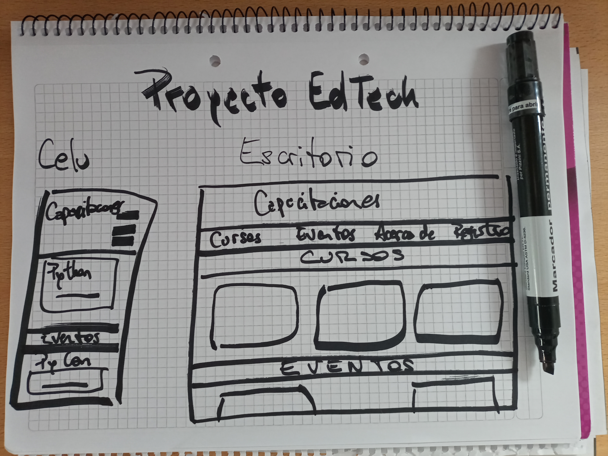

# Proyecto EdTech
Sitio desarrollado para el curso «Python Fullstack» durante el primer cuatrimestre de 2024.

## Acerca del proyecto
Desarrollo símil plataforma educativa con oferta de cursos, promoción de eventos relacionados y con acceso a contenido exclusivo para usuarios registrados.

## Maquetación básica

## Contenido
- Implementación de estructura de las páginas del sitio con lenguaje HTML y etiquetas semánticas.
- Implementación de estilos con lenguaje CSS.

## Desarrollo del proyecto
Durante las clases próximas se incorporará el lenguaje JavaScript para obtener interacción con el sitio e implementar contenido dinámico.

## Objetivo
Obtener un sitio acorde a los lineamientos del «Trabajo Práctico Obligatorio» correspondiente a la parte de fron end del curso.